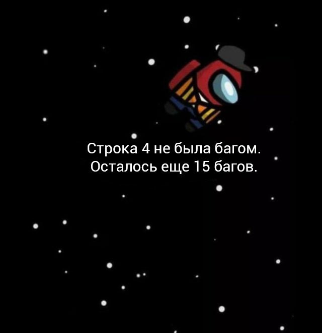

# Коротко о проблемах в процессе создания

### Технические проблемы
 

### Моральные проблемы
 

# Deadline

Задание 2 **До 16.12.2020**

Индивидуально:
1. Выбрать один из алгоритмов:
   клеточный автомат,
   генератор комнат,
   random walk
   свой
2. Реализовать класс для заполнения маски уровня:
   матрицы, содержащей информацию о ячейках
   Можно в группе
3. Составить JSON, который нужен для отображения
   данных об уровне в массив тайлов
   3а. Использовать свой или имеющийся в проекте набор тайлов
4. Сделать сцену, которая строится из маcки уровня и набора тайлов
   (сцена обновляется при каждом запуске)
5. Проверить:
    1. Камера следует за игроком
    2. Можно посчитать метрики
       (% заполнения, число комнат, связность, максимальный размер уровня, расстояние до цели...)
    3. (Опционально) Заполнять несколько уровней карты: пол, украшения, враги/NPC.
    
# Требования к уровню на экзамен:
1. Выполнен уровень в проекте Aurora 
2. Движок Phaser, язык JS 
3. Реализовано движение игрока и ввод с клавиатуры, мыши или геймпада 
4. Реализована хотя бы 1 физическая модель движения (на основе встроенных физических модулей Arcade, Matter или собственная) 
5. Реализована базовая модель поведения (1-2 стиринга) 
6. Реализована модель поведения "верхнего уровня" для NPC (выбор целей на основе одной из моделей: конечный автомат, дерево поведения, нечеткая логика, продукционная модель, blackboard, своя модель) 
7. Реализована процедурная генерация карты по одному из алгоритмов (комнаты, коридоры (случайные блуждания), клеточный автомат, генерация лабиринта, свой алгоритм) 
8. Уровень выполнен в виде отдельной сцены, код предоставлен в виде пулл-реквеста в репозиторий https://github.com/mmcs-gd/aurora2020/	    
    
# Development

```
cd phaser-test
npm install
npm start
```

# Build

```
cd phaser-test
npm run build
cd ./dist
```


